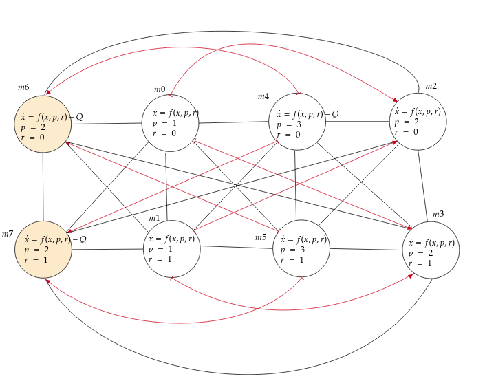
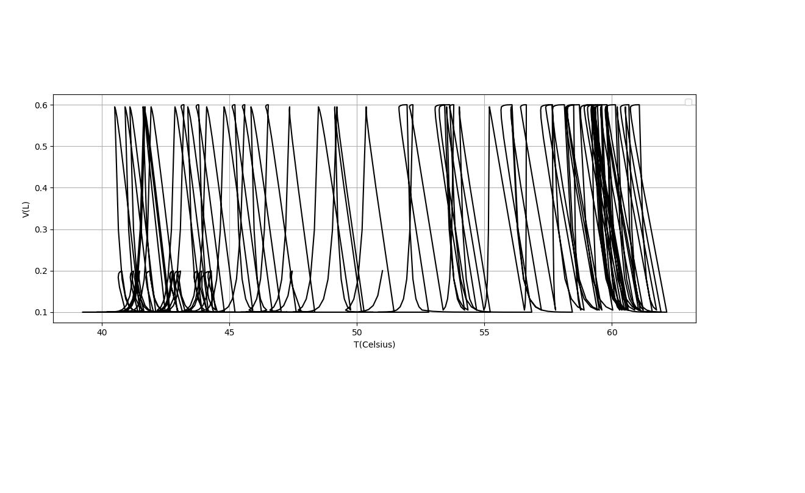
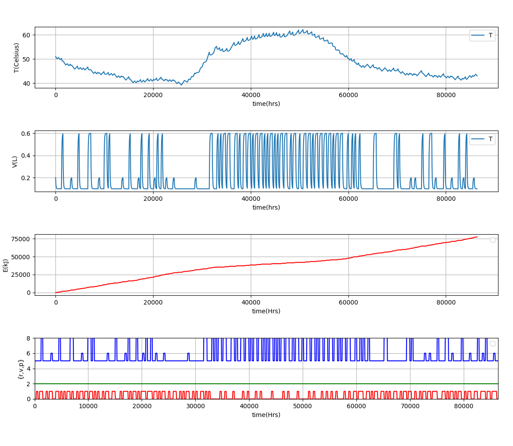

# Safe and Near Optimal Controller Synthesis

This framework, guaranty a safe and near optimal behaviour for hybrid Games.


1. Choose a case of study 

   Examples: A solar water heating 
   
   1.1 System formulation
       
       States: Temperature, Volumen, Energy consumption. 
       
       Actions: 
                Controllable actions:
                      Resistance event: 1,0                
                      Volumen targets: 100L,200L,300L    
                Uncontrollable actions:
                      Valve: 1,0                                

       Disturbance:
                Enviornment Conditions
                  Temperature enviornment
                  Irradiation
                
                                                   
   1.2 Mathematical Modeling 



   ``` c++
      double p,r;   
    p = 1, r = 0; 
    Function m0 = Function(x, Return( - ef*2.8811059759131854e-6*(x[0]-Te)/(0.1*p)                                        
                                            - Interval(0,1)*9.34673995175876e-05*(x[0]-Ti)/(0.1*p)
                                            + 0.7*0.7*8.403225763080125e-07*I/(0.1*p)       
                                            + r*0.008801843/(0.1*p)  
                                            ,0.5*( 0.1*p - x[1]) ) ); // 10s time to assent
    p = 1, r = 1; 
    Function m1 = Function(x, Return( - ef*2.8811059759131854e-6*(x[0]-Te)/(0.1*p)
                                            - Interval(0,1)*9.34673995175876e-05*(x[0]-Ti)/(0.1*p)                                            
                                            + 0.7*0.7*8.403225763080125e-07*I/(0.1*p)       
                                            + r*0.008801843/(0.1*p)  
                                            ,0.5*( 0.1*p - x[1]) ) ); // 10s time to assent


    p = 2, r = 0; 
    Function m2 = Function(x, Return( - ef*2.8811059759131854e-6*(x[0]-Te)/(0.1*p)
                                            - Interval(0,1)*9.34673995175876e-05*(x[0]-Ti)/(0.1*p)
                                            + 0.7*0.7*8.403225763080125e-07*I/(0.1*p)       
                                            + r*0.008801843/(0.1*p)  
                                            ,0.5*( 0.1*p - x[1]) ) ); // 10s time to assent


    p = 2, r = 1; 
    Function m3 = Function(x, Return( - ef*2.8811059759131854e-6*(x[0]-Te)/(0.1*p)
                                            - Interval(0,1)*9.34673995175876e-05*(x[0]-Ti)/(0.1*p)                                        
                                            + 0.7*0.7*8.403225763080125e-07*I/(0.1*p)       
                                            + r*0.008801843/(0.1*p)  
                                            ,0.5*( 0.1*p - x[1]) ) ); // 10s time to assent
    p = 6, r = 0; 
    Function m4 = Function(x, Return( - ef*2.8811059759131854e-6*(x[0]-Te)/(0.1*p)
                                            - Interval(0,1)*9.34673995175876e-05*(x[0]-Ti)/(0.1*p)
                                            - 0.001005026*(0.1*p-x[1])*(x[0]-Ti)/(0.1*p)            //  original -> 0.00009346739
                                            + 0.7*0.7*8.403225763080125e-07*I/(0.1*p)       
                                            + r*0.008801843/(0.1*p)  
                                            ,0.5*( 0.1*p - x[1]) ) ); // 10s time to assent
    p = 6, r = 1; 
    Function m5 = Function(x, Return( - ef*2.8811059759131854e-6*(x[0]-Te)/(0.1*p)
                                            - Interval(0,1)*9.34673995175876e-05*(x[0]-Ti)/(0.1*p)
                                            - 0.001005026*(0.1*p-x[1])*(x[0]-Ti)/(0.1*p)            //  original -> 0.00009346739
                                            + 0.7*0.7*8.403225763080125e-07*I/(0.1*p)       
                                            + r*0.008801843/(0.1*p)  
                                            ,0.5*( 0.1*p - x[1]) ) ); // 10s time to assent

    p = 2, r = 0; 
    Function m6 = Function(x, Return( - ef*2.8811059759131854e-6*(x[0]-Te)/(0.1*p)
                                            - Interval(0,1)*9.34673995175876e-05*(x[0]-Ti)/(0.1*p)
                                            - 0.001005026*(0.1*p-x[1])*(x[0]-Ti)/(0.1*p)            //  original -> 0.00009346739
                                            + 0.7*0.7*8.403225763080125e-07*I/(0.1*p)
                                            + r*0.008801843/(0.1*p)  
                                            ,0.5*( 0.1*p - x[1]) ) ); // 10s time to assent
    p = 2, r = 1;     
    Function m7 = Function(x, Return( - ef*2.8811059759131854e-6*(x[0]-Te)/(0.1*p)
                                            - Interval(0,1)*9.34673995175876e-05*(x[0]-Ti)/(0.1*p)
                                            - 0.001005026*(0.1*p-x[1])*(x[0]-Ti)/(0.1*p)           //  original -> 0.00009346739
                                            + 0.7*0.7*8.403225763080125e-07*I/(0.1*p)       
                                            + r*0.008801843/(0.1*p)  
                                            ,0.5*( 0.1*p - x[1]) ) ); // 10s time to assent


```


2. Safe
   2.1 Finding Patterns 
   
   #### Compiling and Running

   ``` cmd
   mkdir build
   cd build
   cmake ..
   make && ./out
   ```

   The commands above will create a file .txt with all the safe patterns. Then, we import the patterns using our 
   python simulator, which solve and simulate the hybrid system.
   
   
   ``` cmd
   python test.py
   ```
   we can see the figure above how the system is bounded 


   
   
