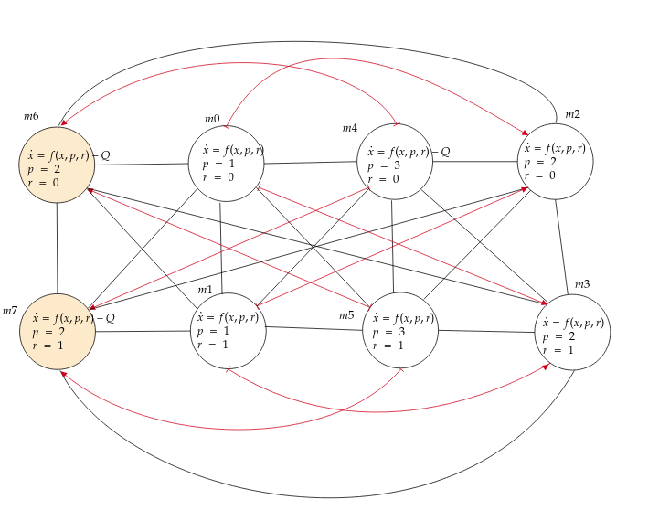

# Safe and Near Optimal Controller Synthesis

This framework, guaranty a safe and near optimal behaviour for hybrid Games. 

1. Choose a case of study 

   Examples: A solar water heating 
   
   1.1 System formulation
       
       States: Temperature, Volumen, Energy consumption. 
       
       Actions: 
                Controllable actions:
                      Resistance event: 1,0                
                      Volumen targets: 100L,200L,300L    
                Uncontrollable actions:
                      Valve: 1,0                                

       Disturbance:
                Enviorment Conditions
                
                                                   
   1.2 Mathematical Modeling 
   
        
